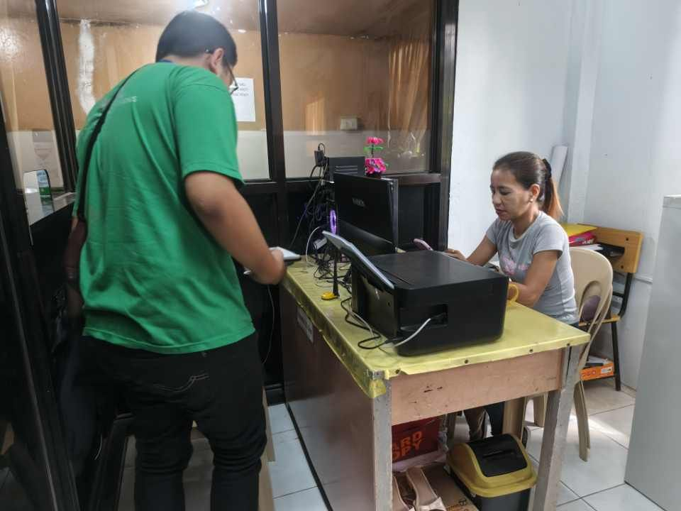

# 🏘️ SmartBarangay: Integrated Document, Announcement, and Certificate Issuance System

**SmartBarangay** is a **web-based management platform** designed to modernize barangay operations by digitizing document processing, automating certificate issuance, and providing a secure communication channel for verified announcements.  
This system enhances **efficiency**, **accessibility**, and **transparency** in local public service.

---

## 📋 Overview

Barangay offices often face challenges such as slow document processing, lack of transparency, and difficulty in managing official announcements.  
**SmartBarangay** addresses these issues by integrating document management, notification, and communication tools into a unified platform that improves operational efficiency and strengthens public trust.

---

## 🚀 Key Features

### 📑 Streamlined Document Management
- Digitized processing and tracking of requests such as certificates. 
- Automated issuance and verification of barangay documents  

### ⏱️ Real-Time Updates
- Users can monitor the **real-time status** of their document requests  
- Barangay officials can update request progress directly through the system

### 🔔 Notifications
- Instant notifications to residents for request updates and announcements  
- Automated reminders for pending requests or approvals

### 🏠 Barangay Dashboard
- Centralized dashboard showing the **real-time operational status** of the barangay  
- Displays insights such as request volume, processing efficiency, and document issuance history

### 📢 Facebook Integration
- Seamless integration with **Facebook** to post official announcements and updates directly from the system  
- Ensures wider reach and verified communication with residents

